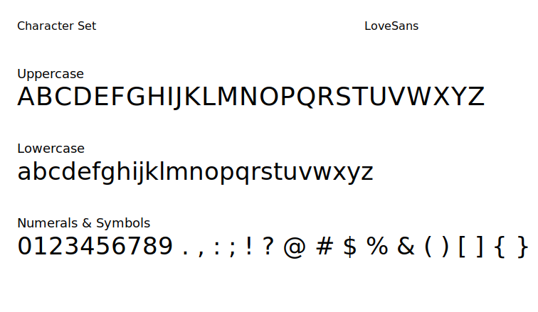
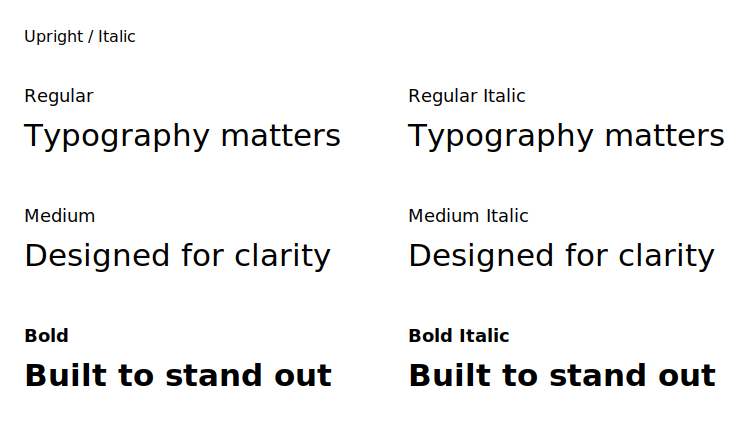
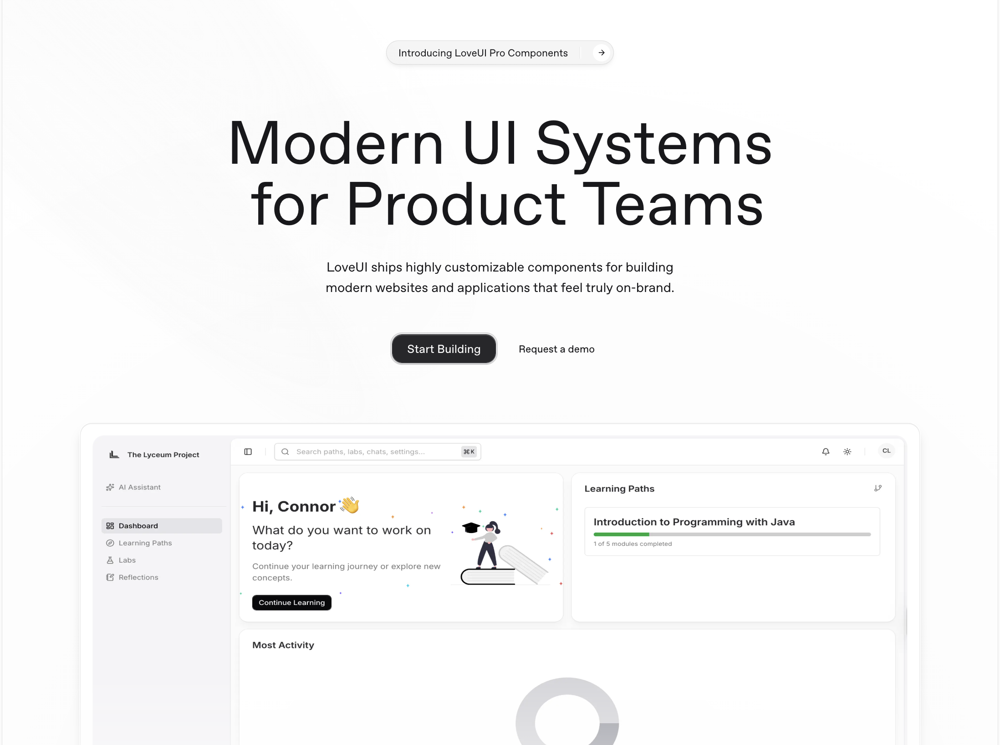
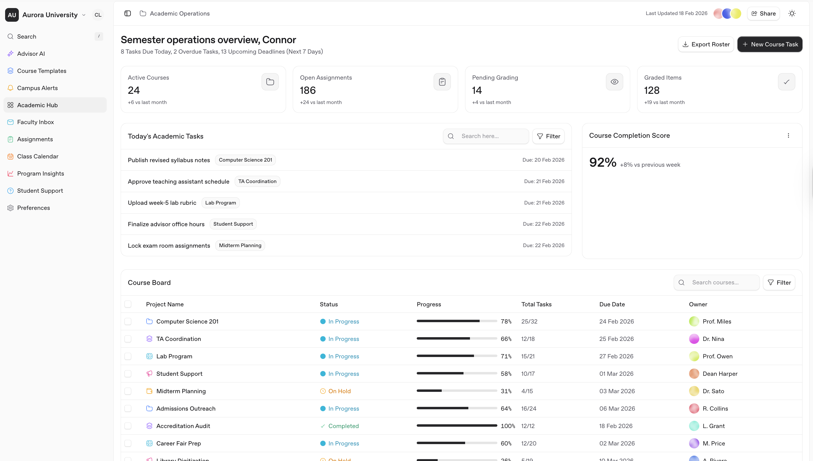

import { createMetadata } from '@/lib/seo'
import imageHero from './hero.svg'
import imageConnorProfile from './connor.jpg'
import imageSpecimenWeb from './specimen-web.png'
import imageSpecimenUi from './specimen-ui.png'

export const caseStudy = {
  client: 'Connor Co.',
  title: 'LoveSans custom typeface system',
  description:
    'A self-initiated type design project focused on creating a clean, modern sans-serif font family for branding, UI, and high-performance web experiences.',
  summary: [
    'LoveSans was created as an original typeface system for modern digital brands. The goal was to design something useful enough for real websites and interfaces, while still feeling distinct and ownable.',
    'The project covered both design and production. It included multiple weights, italic styles, web-ready font exports, and specimen applications that show how the typeface performs across branding and product design.',
  ],
  image: { src: imageHero },
  date: '2026-03',
  service: 'Typeface design & web production',
  testimonial: {
    author: { name: 'Connor', role: 'Founder & Lead Developer' },
    content:
      'LoveSans started as a way to build an original brand asset from the ground up. It became a full type system that shows how design thinking and technical execution come together in real digital work.',
  },
}

export const metadata = createMetadata({
  title: `${caseStudy.title} | Connor Co.`,
  description: caseStudy.description,
  path: '/work/lovesans',
})

## Overview

LoveSans is a custom sans-serif typeface system created as an independent project for modern digital brands. The goal was not simply to make a font, but to build a practical design asset that could function across real websites, interfaces, and brand systems.

Many companies rely on the same familiar font choices. While those fonts can be functional, they rarely create a strong visual identity. LoveSans was designed to explore what happens when typography is treated as a core part of the brand instead of a default decision.

The project focused on clarity, flexibility, and implementation. The family includes multiple weights and italic styles so it can support bold hero headings, interface labels, editorial layouts, and marketing pages. Beyond the visual design of the letterforms, the work also included exporting, organizing, and preparing the font for real web use.

## The challenge

Typography strongly affects how a brand feels, but it is often one of the most overlooked parts of digital design. Many websites use fonts that are acceptable, but generic. That makes it harder for a brand to feel distinctive, polished, and memorable.

The challenge with LoveSans was to create a type system that felt modern and clean without becoming cold or overly mechanical. It needed to be flexible enough for UI and marketing use, but still have enough personality to stand apart from more standard sans-serif choices.

The project also had to go beyond the design of one weight. To be useful in real projects, the family needed a clear structure, consistent rhythm, italic support, and production-ready exports for the web.

## Goals

- Design a custom sans-serif font family with a modern and versatile feel
- Create a system that works across branding, website copy, and interface design
- Build multiple weights and matching italic styles for practical use
- Export the family into web-ready file formats for real implementation
- Show a complete design-to-production process that reflects the same level of care brought into client work

## Approach

The project started with the visual direction. LoveSans was designed to feel clean, balanced, and contemporary. The focus was on building letterforms that were easy to read, visually stable, and flexible enough to work in both display and functional contexts.

After the early direction was established, the work expanded into a full family system. Instead of treating each style as a separate idea, the font was developed as one connected set. Weight, spacing, rhythm, and proportions had to remain consistent across the entire family so that every style felt related.

The family was then prepared for practical use. Each font style was exported into production formats, including WOFF2 for modern web delivery. Organizing the files as a usable system was an important part of the work, because good design assets also need clean implementation.

## Typeface showcase

LoveSans was built as a complete family rather than a single display cut. The finished set includes:

- LoveSans Light
- LoveSans Light Italic
- LoveSans Regular
- LoveSans Regular Italic
- LoveSans Medium
- LoveSans Medium Italic
- LoveSans Semibold
- LoveSans Semibold Italic
- LoveSans Bold
- LoveSans Bold Italic

This structure makes the typeface much more useful in real design systems. Lighter styles can support spacious editorial or minimal layouts, while medium and semibold weights are strong for interface labels and navigation. Bold styles provide contrast for headlines, callouts, and hero sections. The italic variants add flexibility for emphasis, supporting text, and more expressive brand moments.

## Letterforms and character set

A major priority in LoveSans was balance. The typeface needed to feel refined without being fragile, and modern without becoming sterile. That meant paying close attention to spacing, rhythm, and consistency across repeated shapes.

The design was kept intentionally clean so that it could work across a wide range of digital applications. A font used in real products cannot rely only on stylistic novelty. It has to perform well in navigation, body copy, headings, cards, and responsive layouts. LoveSans was shaped around that idea.

The result is a typeface that feels controlled and usable, while still giving a brand a more distinctive foundation than a default system font or an overused free alternative.

## Weight and italic system

One of the main goals for LoveSans was to make the typeface feel like a system rather than a single visual exercise. Each weight was designed to feel clearly distinct, but still part of the same family. That consistency becomes especially important when the font is used across pages, components, and interface states.

The italic styles were also treated as an important part of the family. They add flexibility for emphasis, supporting text, and more expressive moments without breaking visual consistency. Together, the upright and italic styles make LoveSans much more practical for real digital work.

## In use on the web

A custom typeface becomes much more valuable when it can be shown in context. LoveSans was designed to work not just as a specimen, but as a functional asset for digital products and modern marketing sites.

To test that, the font was applied to web layouts that included hero sections, feature grids, calls to action, and supporting content. This helped evaluate how the typeface behaves at multiple sizes and how it supports hierarchy throughout a page.

The result is a font that feels clear and modern in large display applications, but still stable and readable in smaller supporting text.

## In use in product UI

LoveSans was also considered from a product and interface perspective. Fonts behave differently in UI than they do in large marketing layouts. Interface use demands clarity, rhythm, and dependable rendering across labels, buttons, cards, navigation, and denser content blocks.

Testing the typeface in UI scenarios helped confirm that it could support real digital products, not just branding visuals. This makes the family more useful as a system, especially for brands that want one type direction across both website and product experiences.

## Production and implementation

This project also included the technical side of type production. Once the family structure was established, the fonts were exported and organized into formats appropriate for both design workflows and front-end implementation.

The final outputs included web-friendly assets such as WOFF2, which is important for modern websites because it reduces file size while maintaining strong quality. Structuring the font family properly also makes it easier to implement clear `@font-face` rules, map weights correctly, and maintain consistency in production.

Because the project lives at the intersection of branding and development, implementation was treated as part of the deliverable, not a separate afterthought. That matters in real client work, where design decisions only become valuable when they can be shipped cleanly.

## Why this matters for clients

LoveSans is a self-initiated project, but the value of the work is directly relevant to client projects. It shows how custom assets can create a stronger digital identity and how thoughtful systems are built with actual use in mind.

For brands, typography affects first impression, trust, and consistency. A well-designed type system can make a website feel more intentional, more premium, and more aligned with the company behind it. It can also create a foundation that carries through marketing pages, product UI, presentations, and other brand materials.

This project reflects the broader way we approach digital work: not just making things look better, but building systems that are original, practical, and ready to use.

## Outcome

LoveSans became more than a design experiment. It developed into a complete type family that demonstrates both visual judgment and technical execution. The finished system shows the ability to create original brand assets, think in scalable systems, and prepare design work for real web environments.

For Connor Co., the project also serves as a clear example of the kind of detail and craftsmanship brought into client work. Even though LoveSans was self-initiated, the process behind it mirrors how strong digital products are built: clear goals, thoughtful design decisions, and careful implementation from start to finish.

## Project highlights

- Custom sans-serif typeface family
- 5 weights with matching italic styles
- Designed for branding, UI, and web use
- Exported into production-ready font formats
- Built as a complete digital asset system, not a one-off visual exercise

<Blockquote
  author={{ name: 'Connor', role: 'Founder & Lead Developer' }}
  image={{ src: imageConnorProfile }}
>
  LoveSans was an opportunity to build an original asset from the ground up and treat typography as part of the product, not just decoration. It reflects the same care we bring to design systems, branding, and front-end execution for client work.
</Blockquote>

<StatList>
  <StatListItem value="10" label="Font Styles" />
  <StatListItem value="5" label="Weights" />
  <StatListItem value="4" label="Export Formats" />
  <StatListItem value="100%" label="Web Ready" />
</StatList>

## Download LoveSans

The full LoveSans font package is available as a zip download and includes the full family shown in this case study.

  <a
    href="/downloads/lovesans-fonts.zip"
    download
    className="inline-flex rounded-full bg-neutral-950 px-4 py-1.5 text-sm font-semibold text-white transition hover:bg-neutral-800"
  >
    Download LoveSans ZIP
  </a>

